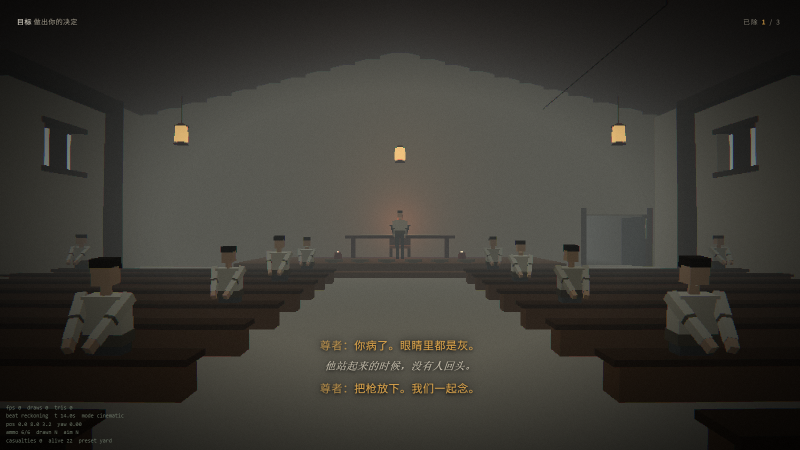
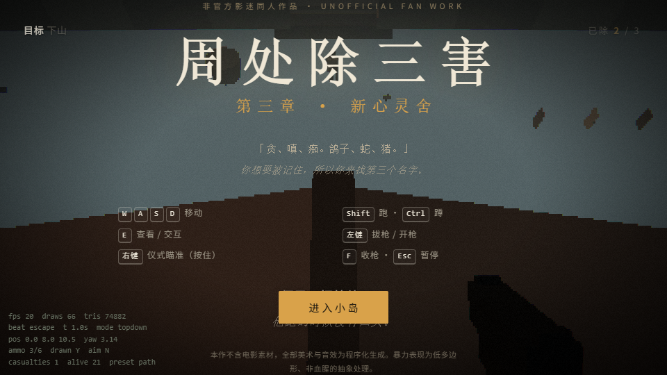
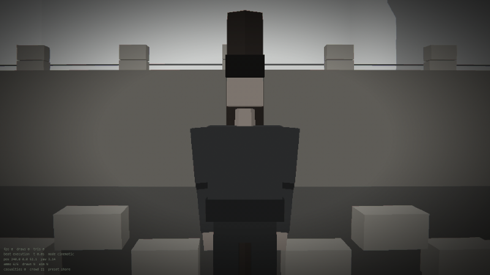
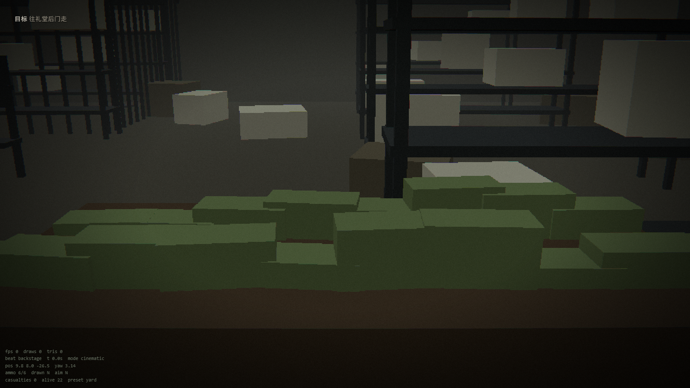

# 周处除三害 · 新心灵舍

**一款非官方的影迷同人第一人称游戏。第三章「新心灵舍」——小岛上的那一场枪。**

你扮演陈桂林，在澎湖外海的小岛上找到通缉榜上排第一的那个人。
他给这里起名叫「新心灵舍」，他让所有人叫他尊者，他让你把身上值钱的东西交出来。

然后你走进后院，看见成箱的现钞、十二只停在不同时间的手表、一堵信徒的信，
以及铁栅栏后面那个不哭的小孩。你走回礼厅，坐到最后一排。

**枪里有六发子弹。要不要用，是你的事。**

> Unofficial fan-made game inspired by the film *The Pig, the Snake and the Pigeon* (2023).
> No film assets are used — every model is procedurally generated geometry and every sound is
> synthesised in real time with the Web Audio API. Non-commercial. Not affiliated with the rights holders.



---

## 玩

- **在线**：<https://li-mingshuang.github.io/zhou-chu-san-hai/>
- **本地**：

  ```bash
  pnpm install
  pnpm dev            # http://localhost:5173
  ```

需要支持 WebGL2 的桌面浏览器。第一次进入要点一下「进入小岛」——浏览器只在用户手势里
允许播放声音、允许锁住鼠标。

如果浏览器拒绝给指针锁（无头环境、某些企业策略、窗口没有焦点），游戏会自动降级：
鼠标视角与开火照常，只是光标不会藏起来。

| 操作 | |
|---|---|
| `W` `A` `S` `D` | 移动 |
| `Shift` / `Ctrl` | 跑 / 蹲 |
| `E` | 查看、交互 |
| 鼠标左键 | 开枪（第一下会同时把枪拔出来） |
| 鼠标右键（按住） | **仪式瞄准**——画面去饱和，世界被闷住 |
| `F` | 收枪 |
| `Esc` | 暂停（灵敏度、音量、像素尺度都在这里调） |

### 调试参数

在地址后面加查询串，用来跳段与检查：

| 参数 | 作用 |
|---|---|
| `?debug=1` | 叠加帧率、draw call、当前节拍、坐标 |
| `?beat=reckoning` | 从指定节拍开始（`arrival` `yard` `ritual` `backstage` `return` `reckoning` `escape` `shore` `ending`） |
| `?shot=reckoning&t=12` | **分镜模式**：摆到该节拍的代表机位并冻结，不响应输入 |
| `?timescale=6` | 时间倍数（用多跑几步实现，不放大 dt） |
| `?pixel=0.4` | 渲染分辨率尺度，越小越"PS1" |
| `?seed=20231124` | 固定程序化随机种子，保证截图可复现 |

---

## 这一章有什么

十一个节拍，约十七分钟。

| # | 节拍 | 镜头 | 你在做什么 |
|---|---|---|---|
| 1 | 抵岛 | 电影 → 第一人称 | 从船上下来，自己走上石阶 |
| 2 | 前院 | 第一人称 | 交出奶奶留下的那只表 |
| 3 | 仪式 | 第一人称 → 电影 | 被点名，被按在长凳上，挨鞭 |
| 4 | 密室 | 第一人称 → 电影 | 推开后山的铁门。里面不是仓库 |
| 5 | 回到礼厅 | 第一人称 | 摸出那把枪，掂了掂 |
| 6 | **开枪** | 第一人称 | 六发子弹，二十几个人 |
| 7 | **下山** | **俯视跑步** | 穿过椰林、石阶、山径，跑到海边 |
| 8 | 海边 | **横版侧视** | 洗脸，刮胡子，走上船 |
| 9 | **自首** | 第一人称 → **正面固定机位** | 走上码头，面前站着一排人 |
| 10 | **刑场** | 正面固定机位 | 三个月后。他走到柱子前面 |
| 11 | 结局 | 字幕 | 三个结局之一 |

### 道场里的人

进门的时候没有一个人抬头。这才是这场戏真正让人发冷的地方。

| 谁 | 在哪 | 在做什么 |
|---|---|---|
| **扫地的** | 大门口 | 一直在扫同一块地，帚头跟着身子左右摆。你走过去他不看 |
| **师姐** | 前院 | 迎你进来，让你把身上值钱的东西放下 |
| **弹吉他唱歌的** | 礼厅前侧 | 坐着弹琴唱歌，整场仪式的背景音就是他；他的词都是「放下就轻了」这一类 |
| **二十个信徒** | 礼厅长凳 | 坐着，念「感谢天地」。开枪之后才分波次站起来：劝你、跪下、或者跑掉 |
| **尊者（老大）** | 讲台最前沿 | 站着一动不动，头顶一束暖光。他不劝也不跑，只是看着你 |

枪响之前的每一次「他们不看」都是刻意的：一旦你拔出枪，这二十个人会在几秒内
分成三种反应，而分成哪三种取决于各自的"胆量"与当时有多慌。

### 镜头会在关键时刻自己动

这是本作最想做的事：**镜头经常不是你。**


`CameraDirector` 统一调度四种机位，切换时把当前姿态冻结成起点、向新模式每帧实时算出的
目标插值，配合 0.35 秒的时间拉伸。于是"视角变了"这件事本身有重量。

| 模式 | 用在哪 | 表现 |
|---|---|---|
| `FirstPerson` | 默认 | 指针锁自由视角，头部摆动，拔枪时视场收缩 |
| `TopDownRun` | **下山** | 14–16 米高、62° 俯角；惯性延迟跟随、转弯侧倾、速度拉高镜头；W 就是"屏幕往上"= 他真正要去的方向 |
| `SideScroll` | 海边 | 长焦侧视，只沿一条轴推进 |
| `Cinematic` | 开场 / 密室 / 受刑 / 自首 / 刑场 | 固定与轨道机位，玩家失去控制，可长按 `Esc` 跳过。自首与刑场用的是**正面固定机位**——全片他第一次被人从正面看着，与礼厅那场第一人称正好相反 |



而在最后两场戏里，镜头第一次站到了他的对面——**正面固定机位**。
自首的时候，一排警察和海在他背后；刑场那一拍几乎去掉了全部颜色。



---

## 设计取向：这不是一个打靶场

片子里那场戏的重量，不在于他打死了多少人，而在于**他一个一个地走过去，没有人拦他**。
所以这一章刻意做成了相反的射击游戏：

- **只有六发，没有备用弹。** 打完就是打完了，按 `R` 只会听见金属空响。
- **没有血量条，没有命中数字，没有血雾。** 中弹的人就是倒下。暴力被处理成低多边形、非血腥的抽象。
- **信徒不是敌人。** 他们没有攻击、不掉东西，只有三种反应：
  `Exhort`（伸手走过来劝你放下枪）、`Kneel`（跪回原位念「感谢天地」）、`Flee`（尖叫着跑出礼厅）。
  谁是哪种，取决于恐怖程度与各自的"胆量"，并且会随着有人倒下重新洗牌——整场戏是从第一个人倒下开始崩的。
- **一个都不开枪是合法通关路径。** 三个结局：

  | 结局 | 条件 |
  |---|---|
  | 「第三害」 | 开了枪，并且真的有人倒下 |
  | 「不开枪的人」 | 拔了枪，但一发都没打 |
  | 「什么都没做」 | 从头到尾没把枪拿出来 |

- **HUD 只有一行极小的字：`已除 1 / 3`。** 进本章时是一（香港仔），尊者是第二格，
  **第三格永远留给你自己**——按剧情，那是第三害。
  你打死多少信徒都不进这个计数。



---

## 技术

| | |
|---|---|
| 渲染 | three.js 0.186 + Vite 7 + TypeScript（strict） |
| 美术 | **零素材**。全部是程序化生成的低多边形几何体：地形是按高度函数采样出来的非索引三角网，每个三角形一个顶点色；匾额、条幅、标语、信徒的信都是 canvas 现画的贴图 |
| 后处理 | 自研单 pass 胶片管线：场景以线性空间渲进低分辨率 RT（半浮点）→ 去饱和与曝光 → 编码 sRGB → 桶形畸变、色差、4×4 有序抖动、暗角、颗粒、闪白、转场压黑。Nearest 放大 + 抖动是"低成本胶片"质感的主要来源 |
| 音频 | **零音频文件**。全部 Web Audio 实时合成：枪声是五层叠加（噪声瞬态经 WaveShaper、超音速爆响、108→58 Hz 胸震、次低音推力、机构余振）并按空间换卷积脉冲响应；六种环境层（海、蝉、礼厅诵经、日光灯嗡鸣、风、静默）交叉淡化；脚步按六种材质分别改滤波与包络 |
| 碰撞 | 不用物理引擎。地板是解析函数（地形 + 平板 + 坡道），墙是轴对齐盒子，圆柱 vs AABB 推出，子弹与视线用 slab 法射线 |
| 合批 | 所有静态几何按材质合并；信徒用带膝关节的骨架（站/坐/跪/倒地都靠它），每人约 16 个 draw call；粒子用 InstancedMesh；远景的信徒按距离剔除。礼厅满员时约 450 个 draw call / 8.3 万三角形 |

程序化文字贴图（`src/render/TextTex.ts`）是这套"零素材"能做到有字可读的关键：
白字透明底 + 每字随机位移旋转 + 低频污渍 + 随机缺墨，交给材质上色与光照。
同一套 canvas 手段也用来生成人物脚下的接触阴影。

### 姿态符号约定

骨架在本地坐标里朝 -Z，肢体自然垂下是 (0,-1,0)。绕 X 轴转 θ 之后，垂下的肢体指向
`(0, -cosθ, -sinθ)`——**θ > 0 是往前抬，θ < 0 是往后甩**。
所以"伸手"、"坐着把大腿抬到身前"、"扫地时上身往前俯"用的都是正角度。

这套骨架最初把符号全写反了：信徒是把手伸到背后劝你，坐着的人两条腿直挺挺穿过长凳
和地板，扫地的上身是往后仰的。而简化骨架（腿不含膝关节）根本没法坐——
一坐下脚就穿到地板下面 33 厘米。这两个问题是靠 `pnpm frames` + `pnpm sketch --vs`
把单个角色的形状抠出来看才发现的。

---

## 怎么确认它真的能跑

这个项目最特别的地方可能是它的验证方式：**没有"我打开浏览器看一眼"这一步。**

```bash
pnpm preview                        # 一个静态服务器（另开一个终端）
pnpm verify                         # 十五个机位逐个加载：读状态 + 截图 + 抓异常
pnpm entry                          # 真实入口：可信鼠标点击开始 → 鼠标输入 → 进礼厅 → 开枪
pnpm play                           # 自动通关：从第一拍一路走到结局卡
pnpm look                           # 谁真的出现在镜头里：拍有人/没人两张比像素
pnpm frames                         # 拍细节帧：把镜头摆到每个角色/道具上
pnpm sketch shots/xxx.png           # 把截图渲染成盲文点阵的简笔画
pnpm inspect shots/xxx.png 88       # 老的亮度图（统计量 + ASCII 灰度）
```

- `tools/cdp.mjs` 是一个最小可用的 Chrome DevTools Protocol 客户端（Node 22+ 自带
  WebSocket 与 fetch，不需要 Playwright）。
- `tools/verify.mjs` 把十五个代表机位各加载一遍（每个机位换一个干净的 Chrome 实例），读回 draw call 数、三角形数、玩家坐标、
  相机坐标、目标与字幕文本，并抓 `#fatal` 与未捕获异常。
- `tools/entry.mjs` 走的是**真人那条路**：用 CDP 派发可信鼠标事件去点「进入小岛」，
  然后检查标题卡收没收起、鼠标输入通不通、礼厅里有没有人、左键能不能真的打出枪。
- `tools/look.mjs` 解决「我读不了图」这件事：同一个机位拍两张——一张有人、一张把那个
  角色藏起来——再比全画面的平均亮度差与变化像素占比。平均差接近 0 就说明镜头对面
  什么都没有。它验过尊者、弹吉他的人、扫地的、师姐，以及从门口看进去的二十个信徒。
- `tools/frames.mjs` 把镜头摆到每一个角色与道具上，成对拍「有／没有」两张。
  机位是从角色的**真实坐标与朝向**推出来的——硬编偏移很容易绕到人背后只拍到后脑勺。
- `tools/sketch.mjs` 是这套工具里最有意思的一个：**把截图渲染成可以用眼睛读的简笔画**。
  管线是 Canny 那一套（自动色阶 → 高斯 → Sobel → 非极大值抑制 → 滞后阈值），
  但输出用的是**盲文点阵**（U+2800–U+28FF）——一个字符里塞 2×4 个点，
  于是 108 列的文本就有 216×144 的有效分辨率。早先一格里只放一个方向字符（- | / \），
  细线一密就糊成一团，完全看不出画面是什么。
  还有 `--vs 另一张.png` 把「多出来/少掉」的部分单独画成形状，
  以及 `--crop`、`--blobs`、`--mode solid|hue`。
- `tools/playthrough.mjs` 是真正的验收：它用**真实的键盘事件**驱动游戏，从抵岛开始，
  交表、坐下、挨鞭、开铁门、翻完密室里的六样东西、拔枪打死尊者、跟着俯视镜头跑下山、
  在海边走到码头，让岸上八个警察现身、自首，再被带到刑场，最后检查结局卡上的清算计数有没有走到 3/3。
- `tools/inspect.mjs` 自己解 PNG（zlib + 手写反滤波），因为没有 Playwright 也就没有图像库。
  它输出平均亮度、标准差、四分区亮度、主色，以及一张 ASCII 亮度图——
  构图可以直接读出来，不必依赖能看图的模型。

上面的"通关成功，十一个节拍全部走通"就是这条命令打出来的。

这套工具抓出过好几个真 bug：`?debug` 的 draw call 数一直是 1（统计被后处理那一趟覆盖了）；过场放完之后玩家永远拿不回控制权；礼堂那一拍的退出判断里两段独立条件在同一帧里连跳两拍，把整个俯视跑步段跳过去了；电影机位下玩家没有身体模型，「看向他」的镜头拍到的是一间空屋子。

而 `pnpm entry` 又抓出一类更难发现的：**标题卡加了 `.hidden` 类，但样式表里根本没有
对应规则**——`#overlay` 已经变透明，标题却还浮在游戏画面上；以及拿不到指针锁时左键
被静默丢弃，于是「开枪打人没有任何效果」。这两个都不是逻辑错误，是"接线没接上"，
只有真的去点一次开始按钮才会暴露。

---

## 目录

```
src/
  core/       Game (唯一的上帝对象) · Input · Settings · Save · Params · EventBus · 数学工具
  render/     Renderer(后处理) · Mats · Geo(合批器) · Particles · Palette · TextTex
  camera/     CameraDirector + 四种机位
  world/      Layout(全部尺寸与地形函数) · Collision · Terrain · Nature · Shell · Props · Execution · Island
  entities/   Player · Pistol · Cultist · Humanoid
  systems/    Interaction · Ballistics · Beat(节拍状态机)
  chapter3/   script.ts —— 十一个节拍的剧本
  ui/         HUD · 字幕 · 菜单（DOM 覆盖层）
  audio/      AudioEngine（1742 行实时合成）
tools/        cdp · verify · playthrough · shots · inspect
```

想改剧情只看 `src/chapter3/script.ts`；想改尺寸只看 `src/world/Layout.ts`。

---

## 版权与边界

- **未使用任何电影素材**：没有画面、剧照、海报、音乐、台词录音。
- 台词是为游戏重写的简短独白与场景化对白，非逐字复制；「感谢天地」作为仪式中的
  四字口头禅保留，属泛指表达。
- 暴力表现为低多边形、非血腥的抽象处理：中弹即倒下，无血雾、无伤口特写。
- 游戏提供完整的"不开枪"路径，并在结局呈现对暴力的反思语气，而不是奖励杀戮。
- 本项目为**非商业**的影迷同人作品，与片方及任何权利人无关联。

代码以 MIT 许可发布（见 `LICENSE`），该许可仅覆盖本项目代码，
不构成对原片任何权利的许可或主张。

---

## English

An unofficial, non-commercial fan game based on the third act of *The Pig, the Snake and the
Pigeon* (2023): a first-person chapter set in a cult compound on a small island, where you are
the hitman who came to find the man at the top of the wanted list.

**Play:** <https://li-mingshuang.github.io/zhou-chu-san-hai/>

The hook is a camera system: the game cuts between first person, a **top-down chase camera**
(the escape down the mountain), a side-scrolling camera (the beach), and cinematic shots, blending
between rigs over 0.35 s of time-stretched transition. You are not always the camera — because what
you are about to do deserves to be watched.

It is deliberately *not* a shooting gallery: six rounds, no spare magazine, no hit markers, no
gore, and the cultists are not enemies — they only plead, kneel, or run. Walking out without
firing is a valid path with its own ending.

Every asset is generated at runtime: low-poly procedural geometry, canvas-drawn signage, and
fully synthesised Web Audio. Verification is automated (`pnpm verify`, `pnpm play`) because the
agent that built it cannot look at pictures.

MIT licensed. Code only. Not affiliated with the film or its rights holders.
